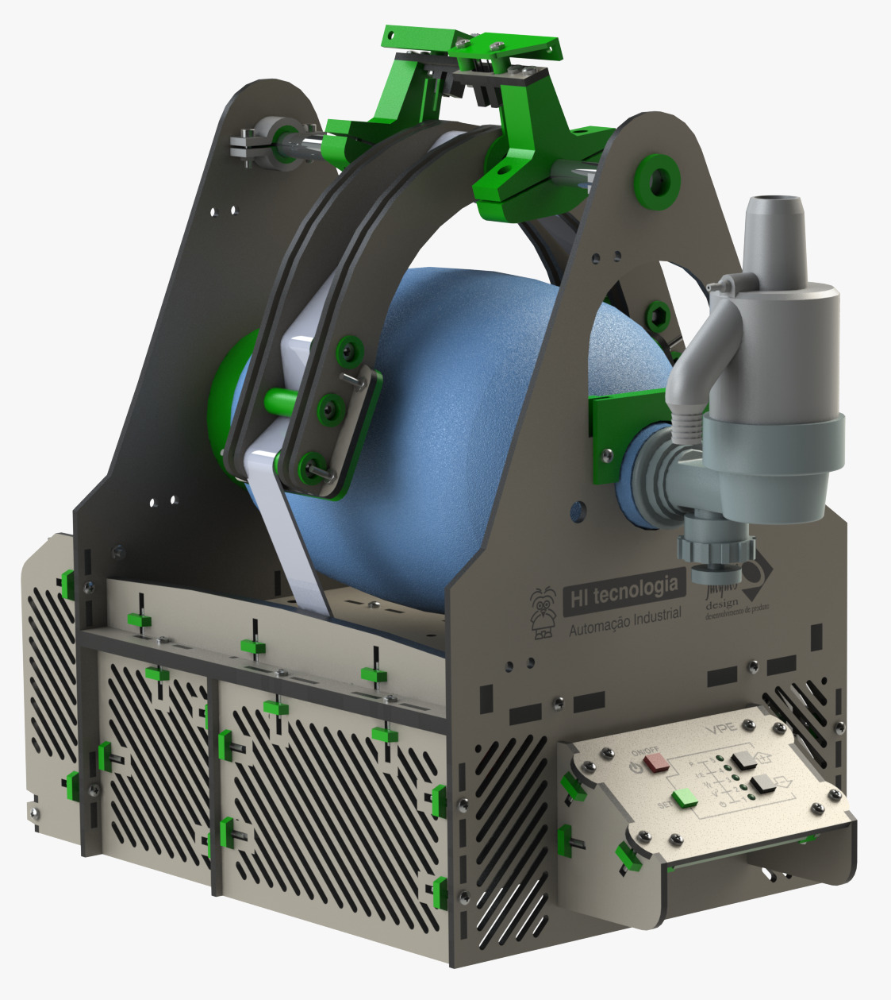

  Portugues |
  <a href="https://github.com/hitecnologia/cov19/tree/master/docs/lang/en-us#cov19">English</a>

  

*VPE19* - Ventilador pulmonar emergencial

  
  

Ventilador pulmonar projetado pela equipe de engenharia e parceiros da HI Tecnologia, com o objetivo de ajudar a salvar vidas durante a pandemia do vírus corona COVID-19.

Nosso objetivo foi criar um ventilador pulmonar simples, barato e que possa ser reproduzido em escala, por outras pessoas, de forma a auxiliar no tratamento dos enfermos do virus corona CODIV-19.

Para chegarmos ao estágio atual foram desenvolvidos 7 protótipos mecânicos e liberadas 2 versões do produto. 
A **versão 1** foi liberada a aproximadamente 30 dias atrás (23//03/2020). 
Durante os testes que continuamos realizando após a liberação desta versão constatamos que o esforço aplicado 
ao motor utilizado para movimentar o AMBU (step motor de 13 Kgf.cm) estava mantendo tanto o motor de passo quanto 
o driver utilizado operando em condições severas, comprometendo sua vida útil e com isto tornando-se inadequado 
para utilização, principalmente em um equipamento médico. 

Começamos então avaliar a possibilidade de utilização de motores maiores que trabalhassem com mais folga. 
Este estudo nos levou a **versão 2** do ventilador. Verificamos que é **mais barato e seguro** utilizarmos 
2 motores menores (com seus respectivos drivers) do que um motor maior com um driver e fonte com maior potência. 

Pelo fato dos motores selecionados serem motores frequentemente utilizados em impressoras 3D e equipamentos similares, 
verificamos que a disponibilidade no mercado é grande e, por exemplo, um motor de 13 Kgf.cm é em média menos da metade
do preço de um motor de 20 Kgf.cm. O mesmo se aplica para o caso dos drivers para motor de passo. Até aproximadamente 3A os custos
dos drivers são baixos, o que não ocorrem para drivers de 4..6A. No caso das fontes esta diferença de custo não é tão acentuada 
mas é proporcional. Um fonte de 12V/6A e praticamente o dobro do preço (90%) de uma fonte de 12V/3A. 

Desta forma, a **versão 2 utiliza 2 motores, 2 drivers e 2 fontes**, permitindo operação com redundância no 
caso de falha, viabilizando manter o paciente ventilado (com restrições de volume) mesmo com falha em um dos motores, 
drives ou fontes, enquanto é providenciada a troca do equipamento.

Por isto, recomendamos a utilização da **versão 2** do projeto. 

Adicionalmente, acrescentamos no projeto eletrônico um driver para o módulo wifi ESP-07 permitindo
que atraves de um celular ou tablet possam ser monitorados e programados todos os parâmetros operacionais
do equipamento.

 Deve ser observado que, apesar de atuarmos nos setor de automação industrial por vários anos e termos obtido
orientação e ajuda de vários profissionais de saúde, não temos expertise em equipamentos médicos e portanto, 
podem ser necessários acréscimos, alterações funcionais ou ajustes no projeto corrente.

Os links a seguir detalham as informaçoes para as duas versões do projeto.

Toda documentação e o repositório do projeto podem ser usados ​​sem limitações.

Nosso único objetivo com este projeto é ajudar a salvar vidas.

## Detalhes do Projeto:

* **<a href="https://github.com/hitecnologia/cov19/tree/master/project/electronic">Projeto eletrônico;</a>**
* **<a href="https://github.com/hitecnologia/cov19/tree/master/project/firmware">Projeto do firmware;</a>**
* **<a href="https://github.com/hitecnologia/cov19/tree/master/project/mechanical">Projeto mecânico.</a>**
* **<a href="https://github.com/hitecnologia/cov19/tree/master/project/application">Projeto de aplicação.</a>** 

**Links:**
* [Site](https://www.hitecnologia.com.br/)
* [LinkedIn](https://www.linkedin.com/company/hi-tecnologia/)

---
