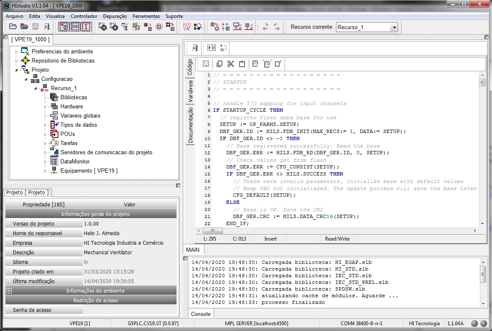

  Portugues |
  <a href="https://github.com/hitecnologia/cov19/tree/master/docs/lang/en-us#cov19">English</a>

  

# VPE - Um ventilador pulmonar emergencial, para ajudar as vítimas do vírus corona

Ventilador pulmonar projetado pela equipe de engenharia e parceiros da HI Tecnologia, 
com o objetivo de ajudar a salvar vidas durante a pandemia do vírus corona.

Deve ser observado que, apesar de atuarmos nos setor de automação industrial 
por vários anos e termos obtido orientação e ajuda de vários profissionais de 
saúde, não temos expertise em equipamentos médicos e portanto, 
podem ser necessárias funcionalidades ou ajustes no projeto corrente.

Toda documentação e o repositório do projeto podem ser usados sem limitações.

## VPE - Aplicação

A aplicação desenvolvida será liberada em um arquivo juntamente com o firmware do módulo **<a href="https://github.com/hitecnologia/cov19/tree/master/project/electronic">COD19-R0</a>**.

As informações e links a seguir são necessárias caso seja necessário ou de interesse
ver o programa de aplicação ou modifica-lo para adequações ou melhorias.

As aplicações presentes a seguir foram desenvolvidas em **linguagem ST** utilizando o ambiente de 
desenvolvimento **HIstudio** da HI Tecnologia. 

  

Para este projeto, foi customizada uma versão do **HIstudio** (versão 19.0.0) 
que suporta o módulo de hardware desenvolvido denominado de **COV19**.
Esta versão pode ser obtida gratuitamente no link abaixo:

 - **<a href="https://www.hitecnologia.com.br/media/uploads/box/installhistudio19.0.00.exe">HIstudio Ver 19.0.0</a>** 

Para se comunicar com o módulo é necessário um canal serial (ou conversor usb/serial) 
visto que foi disponibilizado apenas os pinos TX/RX para esta função. Deve-se utilizar um driver TTL/RS232-C 
para esta comunicação. Este módulo é facilmente encontrado no mercado.

Por exemplo:
   https://produto.mercadolivre.com.br/MLB-1306467688-modulo-conversor-rs232-ttl-max232-db9-0408-_JM

ou outro similar.

Para permitir a comunicação do **HIstudio** com o módulo será necessário a utilização do servidor de comunicação **MPL Server**. 
Este servidor (OPC Server) foi desenvolvido pela HI Tecnologia e pode ser baixado gratuitamente no <a href="https://www.hitecnologia.com.br">nosso site</a>,
ou diretamente no link abaixo. 
 
 - **<a href="https://www.hitecnologia.com.br/downloads/installmplserver1.0.15.exe">Servidor OPC MPL Server</a>**
 
**Obs:** Será necessário um cadastro prévio para baixar este aplicativo. 
            
Com estes 2 ambientes instalados é possível abrir a aplicação disponibilizada a seguir.

### Items da aplicação

 - **<a href="https://github.com/hitecnologia/cov19/tree/master/project/application/VPE19_1000.dpk">Aplicação VPE19_1000</a>**. Compatível com o **<a href="https://github.com/hitecnologia/cov19/tree/master/project/firmware">Firmware VPE19-1-G5PLC_CV19_ST-0097</a>** 

**OBS:** Estamos trabalhando em elaborar o manual simples da interface e tão logo esteja concluído estaremos disponibilizando o mesmo. 

**Links:**
 - [HI Tecnologia Site](https://www.hitecnologia.com.br/)

---

