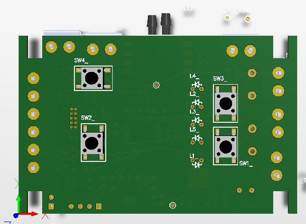
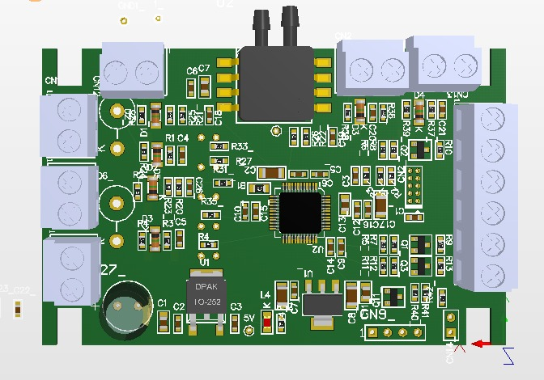

  Portugues |
  <a href="https://github.com/hitecnologia/cov19/tree/master/docs/lang/en-us#cov19">English</a>

  

*COV19* - Um ventilador pulmonar emergencial, para ajudar as vítimas do vírus corona 

Ventilador pulmonar projetado pela equipe de engenharia e parceiros da HI Tecnologia, 
com o objetivo de ajudar a salvar vidas durante a pandemia do vírus corona.

Nosso objetivo foi criar um ventilador pulmonar simples, barato e que possa ser 
reproduzido em escala, por outras pessoas, de forma a auxiliar no tratamento 
dos enfermos do virus corona.

Deve ser observado que, apesar de atuarmos nos setor de automação industrial 
por vários anos e termos obtido orientação e ajuda de vários profissionais de 
saúde, não temos expertise em equipamentos médicos e portanto, 
podem ser necessárias funcionalidades ou ajustes no projeto corrente.

Toda documentação e o repositório do projeto podem ser usados ??sem limitações.

Projeto eletrônico

  
  

O hardware desenvolvido possui os seguintes recursos:

 * Alimentação principal de 12 volts DC (10.5 .. 14VDC) com previsão para conexão
   de bateria para manter o equipamento funcionando em caso de falta de energia.
 * Processador ARM-CORTEX-M0 com 256Kb de Flash e 32Kb de RAM.
 * 2 Entradas digitais para monitorar 2 chaves (limit switchs) para sincronização e segurança 
   do movimento.
 * 4 entradas digitais associadas a 4 chaves para operaçao do equipamento
 * 3 Saídas digitais para controle do driver de step-motor (pulso, direção e habilitação)
 * 1 Saída digital para controle de uma sinalizador sonoro para alarme
 * 5 Saídas digitais para acionamento de 5 led's de sinalizacao da interface
 * 1 Entrada analógica conectada a um sensor de pressão (faixa de 0..10Kpa)
 * 1 Entrada analógica monitorar a tensão de alimentação do equipamento
 * 1 Entrada analógica reserva (0..5Vdc)
 * 1 interface serial (TX/RX em barra de pinos)
 * 1 conector para carga do firmware/aplicação via programador JTAG

## Detalhes do Projeto:

* **<a href="https://github.com/hitecnologia/cov19/tree/master/project/electronic/BOM_PartType-PDE921000100.htm">Lista de materiais</a>**
* **<a href="https://github.com/hitecnologia/cov19/tree/master/project/electronic/COV19_STL.zip">Arquivos Geber</a>**
* **<a href="https://github.com/hitecnologia/cov19/tree/master/project/electronic/PDE921000100.pdf">Documentação eletrônica</a>**

**Links:**
* [HI Tecnologia Site](https://www.hitecnologia.com.br/)

---

