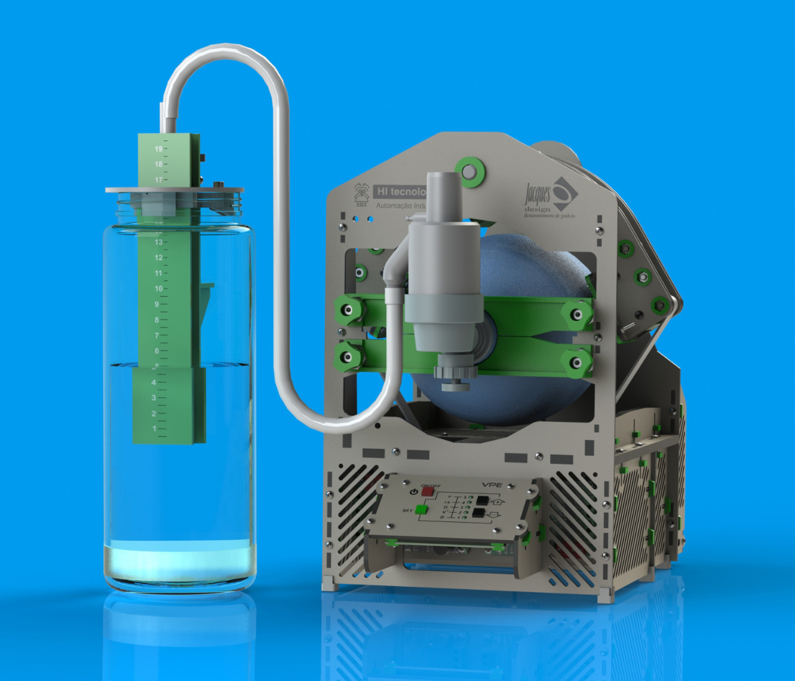
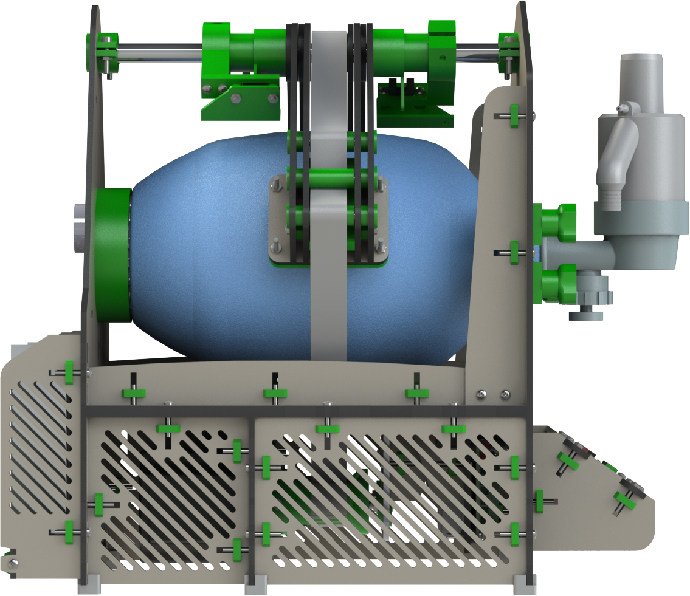
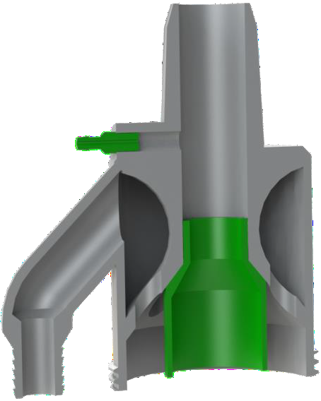
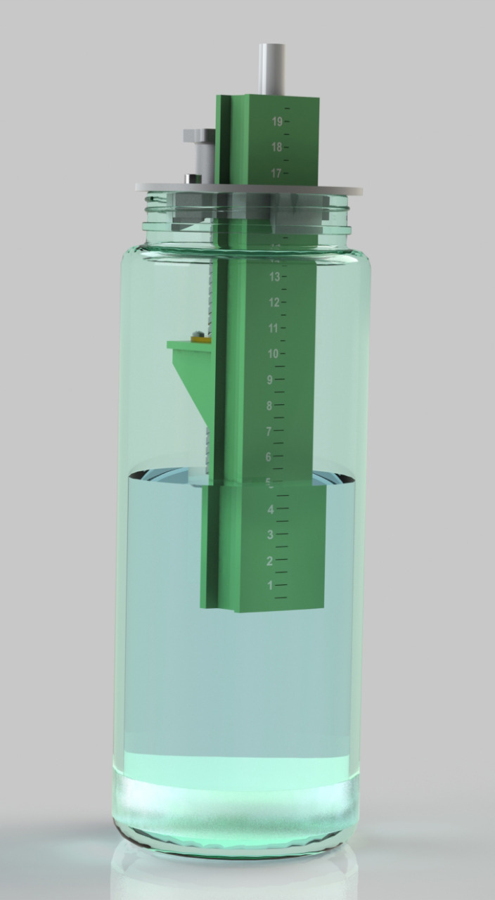
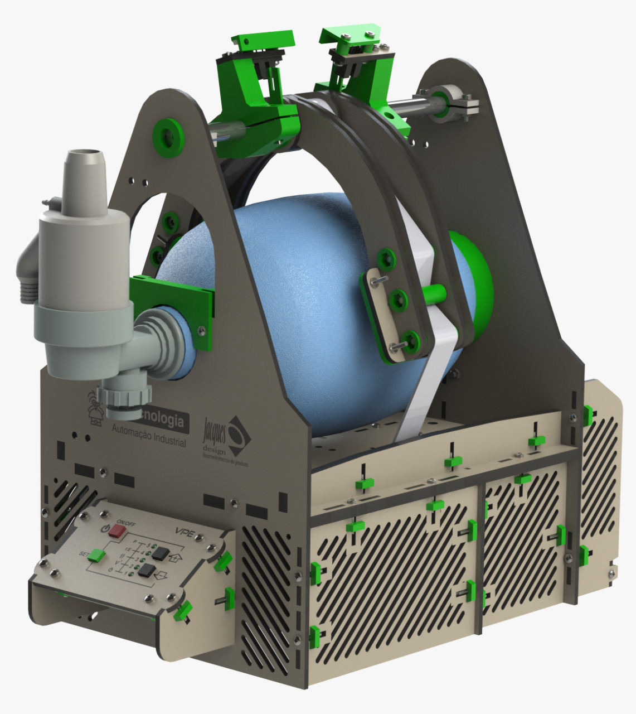
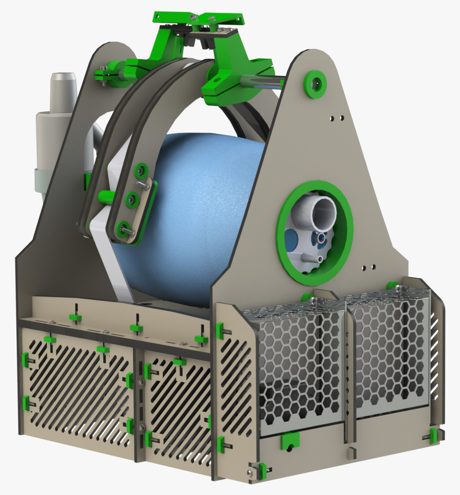
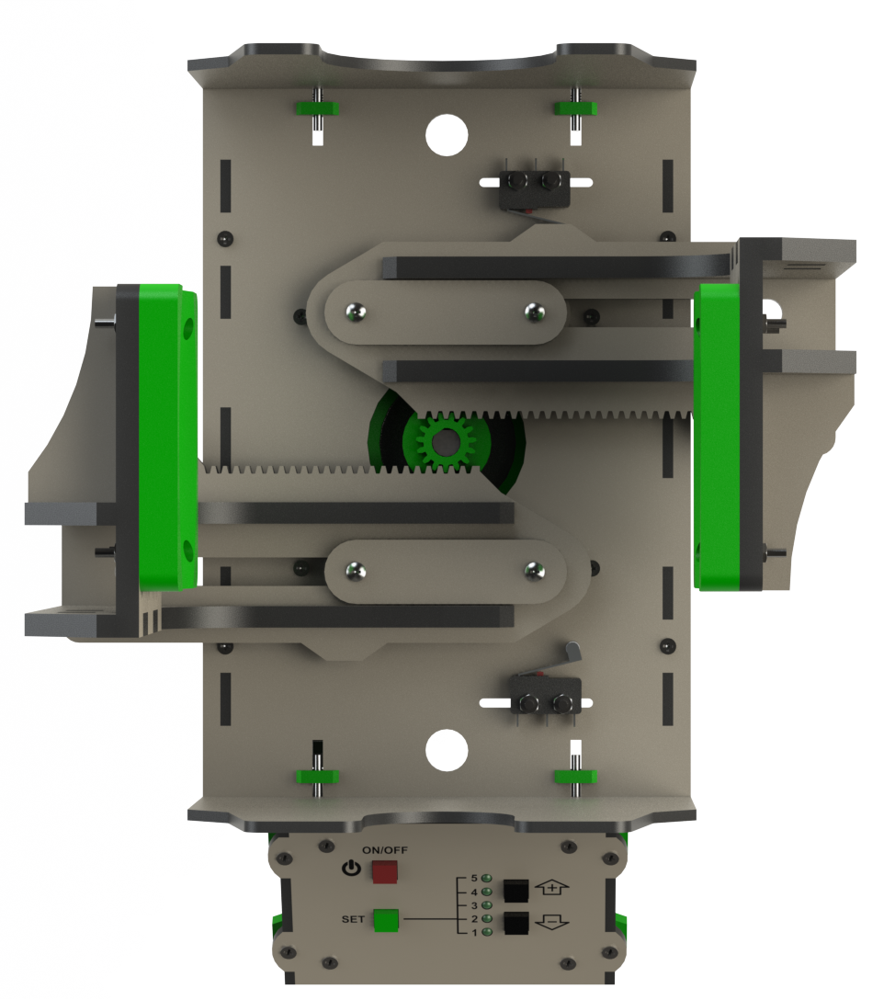
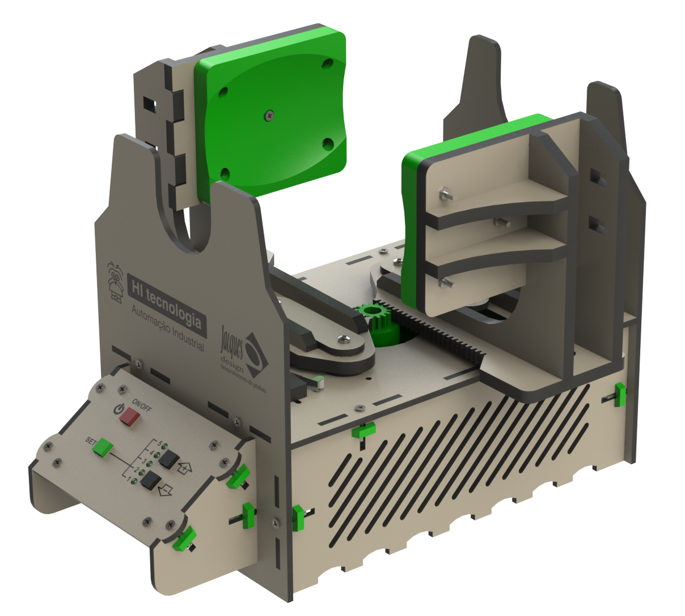

  Portugues |
  <a href="https://github.com/hitecnologia/cov19/tree/master/docs/lang/en-us#cov19">English</a>

  

# VPE-19 - Ventilador pulmonar emergencial

Ventilador pulmonar projetado pela equipe de engenharia e parceiros da HI Tecnologia, 
com o objetivo de ajudar a salvar vidas durante a pandemia do vírus corona COVID-19.

Para chegarmos ao estágio atual foram desenvolvidos 7 protótipos mecânicos e liberadas 2 versões do produto. 
A **versão 1** foi liberada a aproximadamente em 23/03/2020. 
Durante os testes que continuamos realizando após a liberação desta versão constatamos que o esforço aplicado 
ao motor utilizado para movimentar o AMBU (step motor de 13 Kgf.cm) estava mantendo tanto o motor de passo quanto 
o driver utilizado operando em condições severas, comprometendo sua vida útil e com isto tornando-se inadequado 
para utilização, principalmente em um equipamento médico. 

Começamos então avaliar a possibilidade de utilização de motores maiores que trabalhassem com mais folga. 
Este estudo nos levou a **versão 2** do ventilador. Verificamos que é **mais barato e seguro** utilizarmos 
2 motores menores (com seus respectivos drivers) do que um motor maior com um driver e fonte com maior potência. 

Pelo fato dos motores selecionados serem motores frequentemente utilizados em impressoras 3D e equipamentos similares, 
verificamos que a disponibilidade no mercado é grande e, por exemplo, um motor de 13 Kgf.cm é em média menos da metade
do preço de um motor de 20 Kgf.cm. O mesmo se aplica para o caso dos drivers para motor de passo. Até aproximadamente 3A os custos
dos drivers são baixos, o que não ocorrem para drivers de 4..6A. No caso das fontes esta diferença de custo não é tão acentuada 
mas é proporcional. Um fonte de 12V/6A e praticamente o dobro do preço (90%) de uma fonte de 12V/3A. 

Desta forma, a **versão 2 utiliza 2 motores, 2 drivers e 2 fontes**, permitindo operação com redundância no 
caso de falha, viabilizando manter o paciente ventilado (com restrições de volume) mesmo com falha em um dos motores, 
drives ou fontes, enquanto é providenciada a troca do equipamento.

Por isto, recomendamos a utilização da **versão 2** do projeto. 

Adicionalmente, acrescentamos no projeto eletrônico um driver para o módulo wifi ESP-07 permitindo
que através de um celular ou tablet possam ser monitorados e programados todos os parâmetros operacionais
do equipamento.

Deve ser observado que, apesar de atuarmos nos setor de automação industrial por vários anos e termos obtido
orientação e ajuda de vários profissionais de saúde, não temos expertise em equipamentos médicos e portanto, 
podem ser necessários acréscimos, alterações funcionais ou ajustes no projeto corrente.

Os links a seguir detalham as informações para versões e atualizações do projeto.

Toda documentação e o repositório do projeto podem ser usados ​​sem limitações.

Nosso único objetivo com este projeto é ajudar a salvar vidas.

## VPE-19 - Versão 2.1 (10/05/2020)

 * Melhorias na fixação dos sensores;
 * Alterado projeto de fixação do Ambu para permitir a troca mais rápida;
 * Redimensionado painel de operação;
 * Reposicionados os motores e o braço de compressão para diminuir o torque.

  
  

### Detalhes do Projeto:

* **<a href="https://github.com/hitecnologia/cov19/tree/master/project/mechanical/v2.1/vpe_v21_dfx.zip">VPE19 - DXF Files (V2.1)</a>**
* **<a href="https://github.com/hitecnologia/cov19/tree/master/project/mechanical/v2.1/vpe_v21.stl.zip">VPE19 - STL Files (V2.1)</a>**
* **<a href="https://github.com/hitecnologia/cov19/tree/master/project/mechanical/v2.1/instruction_manual_v21.pdf">VPE19 - Manual de instruções (V2.1)</a>**
                                                                                      

## CCE - Válvula de captura de expiração

Esta vávula tem por objetivo desviar o fluxo expiratório do AMBU para um filtro 
e prover um acesso para monitoração da pressão do ciclo respiratório. 
Ela é instalada na boca do AMBU (remove-se a saída original). Este projeto foi 
desenvolvido para o AMBU da marca LUMIAR. Outros modelos podem necessitar de 
adaptações.  

  

### Detalhes do Projeto:

* **<a href="https://github.com/hitecnologia/cov19/tree/master/project/mechanical/CCE_AMBU_STL.zip">CCE-STL Files</a>**

Obs: O pino para encaixe da mangeira do sensor se mostrou muito frágil devido a pequena dimensão. 
Utilizamos posteriormente um pedaço de tubo plástico de haste de cotonete que funcionou perfeitamente. 

## PEEP - Acessório para regular o PEEP

Este acessório foi desenvolvido para permitir regular a pressão residual (PEEP) durante os 
testes dos ventilador. Pode ser útil nos testes de outras soluções.

  

### Detalhes do Projeto:

* **<a href="https://github.com/hitecnologia/cov19/tree/master/project/mechanical/peep/PEEP_DXF.zip">PEEP-DXF Files</a>**
* **<a href="https://github.com/hitecnologia/cov19/tree/master/project/mechanical/peep/PEEP_STL.zip">PEEP-STL Files</a>**

## VPE-19 - Versão 2 (25/04/2020)

 * Modificado projeto mecânico para operação com 2 motores.

  
  

### Detalhes do Projeto:

* **<a href="https://github.com/hitecnologia/cov19/tree/master/project/mechanical/v2/VPE_DXF.zip">VPE19 - DXF Files</a>**
* **<a href="https://github.com/hitecnologia/cov19/tree/master/project/mechanical/v2/VPE_STL.zip">VPE19 - STL Files</a>**
* **<a href="https://github.com/hitecnologia/cov19/tree/master/project/mechanical/v2/instructions_manual_v2.zip">VPE19 - Manual de instruções</a>**
* **<a href="https://github.com/hitecnologia/cov19/tree/master/project/mechanical/v2/bill_list_v2.pdf">VPE19 - Lista de insumos</a>**
                                                                                      

## VPE-19 - Versão 1  (23/03/2020)

* Projeto inicial 

  
  

### Detalhes do Projeto:

* **<a href="https://github.com/hitecnologia/cov19/tree/master/project/mechanical/COV19_DXF.zip">VPE - DXF Files</a>**
* **<a href="https://github.com/hitecnologia/cov19/tree/master/project/mechanical/COV19_STL.zip">VPE - STL Files</a>**
* **<a href="https://github.com/hitecnologia/cov19/tree/master/project/mechanical/instruction_manual.zip">VPE - Instructions Manual</a>**

**Links:**
* [HI Tecnologia Site](https://www.hitecnologia.com.br/)
* [Jacques Design Site](https://www.hitecnologia.com.br/)

---
