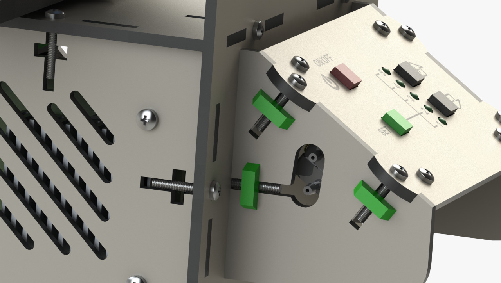

  Portugues |
  <a href="https://github.com/hitecnologia/cov19/tree/master/docs/lang/en-us#cov19">English</a>

  

# VPE - Um ventilador pulmonar emergencial, para ajudar as vítimas do vírus corona

Ventilador pulmonar projetado pela equipe de engenharia e parceiros da HI Tecnologia, 
com o objetivo de ajudar a salvar vidas durante a pandemia do vírus corona.

Deve ser observado que, apesar de atuarmos nos setor de automação industrial 
por vários anos e termos obtido orientação e ajuda de vários profissionais de 
saúde, não temos expertise em equipamentos médicos e portanto, 
podem ser necessárias funcionalidades ou ajustes no projeto corrente.

Toda documentação e o repositório do projeto podem ser usados ​​sem limitações.

## VPE - Ventilador Pulmonar Emergencial

  
  
  

## Detalhes do Projeto:

* **<a href="https://github.com/hitecnologia/cov19/tree/master/project/mechanical/COV19_DXF.zip">VPE - DXF Files</a>**
* **<a href="https://github.com/hitecnologia/cov19/tree/master/project/mechanical/COV19_STL.zip">VPE - STL Files</a>**
* **<a href="https://github.com/hitecnologia/cov19/tree/master/project/mechanical/instruction_manual.zip">VPE - Instructions Manual</a>**

## CCE - Válvula de captura de expiração

Esta vávula tem por objetivo desviar o fluxo expiratório do AMBU para um filtro 
e prover um acesso para monitoração da pressão do ciclo respiratório. 
Ela é instalada na boca do AMBU (remove-se a saída original). Este projeto foi 
desenvolvido para o AMBU da marca LUMIAR. Outros modelos podem necessitar de 
adaptações.  

  

## Detalhes do Projeto:

* **<a href="https://github.com/hitecnologia/cov19/tree/master/project/mechanical/CCE_AMBU_STL.zip">CCE-STL Files</a>**

**Links:**
* [HI Tecnologia Site](https://www.hitecnologia.com.br/)
* [Jacques Design Site](https://www.hitecnologia.com.br/)

---

